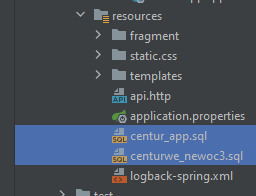
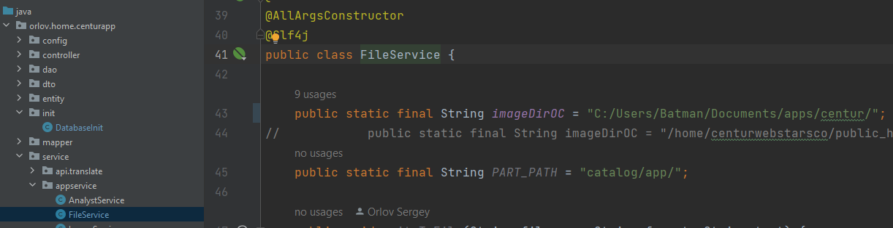

# centurapp

## Viorina-Deko parser

Перед запуском импортируем схемы с таблицами в MySQL (почистил их). Скрипты тут:

Меняем путь для сохранения фотографий на свой (43 строка) в FileService:

Реализация парсера по сайту http://viorina-deko.com/ua/ находится в классе ParserServiceViorinaDeko.

Для запуска парсера заходим сюда http://localhost:8080/admin/block и жмякаем запустить парсер. Либо сразу по ссылке http://localhost:8080/admin/block/parsing

В ManagerService закоментированы стороние парсеры.

Данные авторизации
* Логин: centur
* Пароль: centur_409759814
